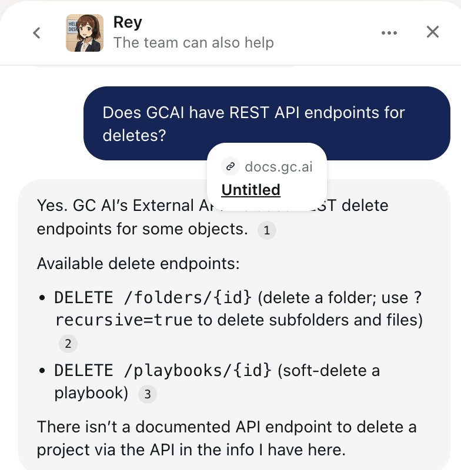
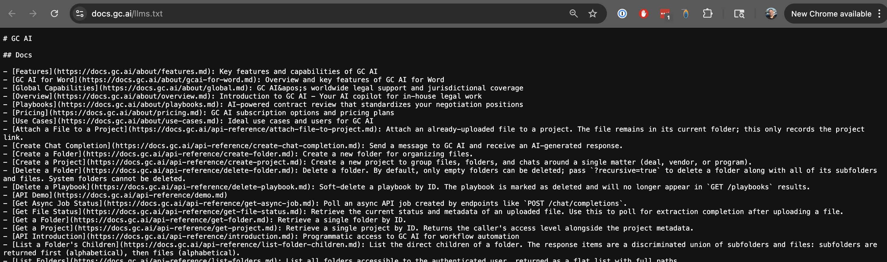

# Support Engineer Challenge

### Parts 1, 2 and 3 deliverable

- [Part 1: Product Investigation](https://dhbtuus86mod.cloudfront.net/product_investigation.mp4)
- [Part 1 write-up](part-1-writeup.md)
- [Part 2: Support Experience](https://dhbtuus86mod.cloudfront.net/part-2-support-experience-audit.mp4)
- [Part 3 problem interpretation write-up](problem-interpretation.md)

---

## Audit

#### (a) Evaluate the current support experience end-to-end — the AI responses, the help articles, the docs site, the overall flow. What worked? What didn't? Where did the AI give you a useful answer vs. a generic one? Where did you hit a dead end? Be specific, include screenshots if helpful.

From what I currently understand from the product, the support experience I had via Intercom and overall flow was smooth. Responses were in general decent. It provided answers to the questions that I had and it pointed to relative documentation. There was an issue that I mentioned in the recording where it showed a link to documentation which took us to an LLM text.



and navigating to what that `untitled` links to:


#### (b) What's the single biggest gap in the current support experience that you'd want to fix first, and how would you fix it?

Support experience was generally effective in the areas I tested. The biggest improvement I would make is not adding more docs, but making the support path more discoverable from inside the exact workflow when the user face an issue and get stuck. for exmaple,

```
need help? open support with this project URL and error context attached
```

#### (c) If you could change one thing about how the AI agent responds to users, what would it be and why?

Didn't see any reason to change the agent's tone or the way it respondes overall, but I would look inot doing away with its immediate follow ups right after it provides a response, `Is that what you were looking for?` or `Did that answer your question?`. If the idea is to get feedback/training, then I would use a thumbs up/down approach.

### Part 3: Build Something

A CLI that takes a JSON array of raw bug-report strings and transforms each one into a structured triage output. Crucially, it does **not** force every input into a ticket — each report is classified into one of four buckets, each with its own output shape:

1. `actionable_ticket` — enough context to file directly.
2. `partial_ticket_needs_clarification` — real bug signal but key facts missing; emits a draft + clarifying questions.
3. `too_vague_request_more_info` — too thin to draft; emits only clarifying questions.
4. `non_bug_support_question` — not a bug; routes away from engineering (how-to, billing, feature request, status).

#### Quick start

```bash
bun install
cp .env.example .env   # fill in ANTHROPIC_API_KEY
```

#### Commands

| Command             | What it does                                                                                                                                                                                  |
| ------------------- | --------------------------------------------------------------------------------------------------------------------------------------------------------------------------------------------- |
| `bun run test`      | Runs Vitest suite (56 tests across schema, classifier, CLI). Uses a mocked Anthropic client — no API key, no network.                                                                         |
| `bun run typecheck` | `tsc --noEmit` strict-mode pass.                                                                                                                                                              |
| `bun run cli`       | Reads a JSON array of strings from stdin or a file path, classifies each, writes a JSON array to stdout. Requires `ANTHROPIC_API_KEY`.                                                        |
| `bun run eval`      | Runs the live model over the 20-entry messy corpus in [tests/fixtures/raw-inputs.ts](tests/fixtures/raw-inputs.ts), compares to expected labels, exits non-zero if agreement falls below 70%. |

#### Input format

The CLI accepts a **JSON array of strings**, where each string is one raw bug report. You can pass any file path or pipe JSON over stdin — the repo ships a 4-entry demo at [tests/fixtures/example-input.json](tests/fixtures/example-input.json) for the "Try it" commands below.

```json
["raw bug report text from user 1", "raw bug report text from user 2"]
```

The 20-entry "messy" corpus used by `bun run eval` lives in [tests/fixtures/raw-inputs.ts](tests/fixtures/raw-inputs.ts) (TypeScript, includes expected labels for eval) — not directly consumable by the CLI.

#### Try it

A copy-paste checklist a reviewer can run end-to-end. Each step takes <10s; the file-arg run is the best "does this thing actually work" demo.

**Happy paths** (require `ANTHROPIC_API_KEY` in env or `.env`):

```bash
# 1. file arg — 4 entries, one per classification
bun run cli tests/fixtures/example-input.json

# 2. stdin pipe — one entry, should be classified as too_vague
echo '["upload is broken"]' | bun run cli

# 3. override the model
ANTHROPIC_MODEL=claude-haiku-4-5 bun run cli tests/fixtures/example-input.json
```

**Error paths** (should fail loud with exit code 2 and a stderr message — no API call made):

```bash
echo 'not json' | bun run cli                # invalid JSON
echo '{"foo":"bar"}' | bun run cli           # not a JSON array
echo '["ok", 42]' | bun run cli              # array contains a non-string
( unset ANTHROPIC_API_KEY; echo '[]' | bun run cli )   # missing API key
```

**Edge case:**

```bash
echo '[]' | bun run cli   # empty array → prints "[]", exits 0
```

**What to look for in the output:**

- A banner + per-entry dots on **stderr** while the batch runs (e.g. `Classifying 4 reports against model=claude-sonnet-4-6 (concurrency=5)...` then `....` then `done.`). Each entry typically takes 3-15s; for 20 entries plan on 30-60s total.
- The final JSON goes to **stdout** only, so `bun run cli input.json | jq` works cleanly. To suppress the banner entirely, redirect: `bun run cli input.json 2>/dev/null`.
- Pretty-printed JSON array, one entry per input, in input order.
- Each entry has a positional `report_id` (`report-0`, `report-1`, …) and an `original_input` echo.
- Per-entry classification failures show up as `{ "classification": "error", "report_id", "original_input", "error": { "stage", "message" } }` inline — the batch keeps going.

#### How it works

**Schema-first.** Every output conforms to a [Zod discriminated union](src/schema.ts) over the four classifications. Each variant is `.strict()`, so unknown keys are rejected — that's what catches LLM drift. Inferred TS types flow downstream so the rest of the code knows exactly which fields exist on which variant.

**Anthropic tool-use with double validation.** [classifyReport](src/classify.ts) sends each report with a forced `tool_choice`. The tool's `input_schema` is a flat object (Anthropic rejects `oneOf`/`anyOf` at the root of tool schemas), so per-variant required-field enforcement happens after the call: `LLMOutputSchema.safeParse(tool_use.input)` first (precise blame on the model), then `ParsedReportSchema.safeParse(merged)` (final contract guarantee after merging in runner-owned `report_id` and `original_input`).

**Prompt design.** The [system prompt](src/prompt.ts) carries the rubric: four classifications with definitions, a severity scale, the category enum, anti-hallucination rules, and explicit per-variant field-discipline lists (each variant's allowed fields with "do NOT emit anything else"). The prompt is marked `cache_control: ephemeral` so Anthropic caches it for ~5 min — every report in a batch after the first benefits.

**Two test surfaces.** Mocked tests run the schema, classifier, and CLI logic against a fake `AnthropicClient` — fast, deterministic, no API key. The live [eval script](scripts/eval.ts) runs the real model over the messy corpus and reports per-entry agreement with a 70% floor. They answer different questions: unit tests answer "is my code correct?"; the eval answers "does the model handle real ugliness?"

#### Project layout

```
src/
  schema.ts          # Zod discriminated union + strict variants + inferred types
  types.ts           # stable re-export surface for downstream imports
  prompt.ts          # system prompt + cache_control config
  tool-schema.ts     # flat JSON Schema for the tool; strict per-variant validator
  llm-client.ts      # AnthropicClient interface + real SDK factory
  classify.ts        # classifyReport (the LLM orchestrator)
  cli.ts             # runCli (parse input, concurrent classify, build entries)
  index.ts           # CLI entry — stdin/argv -> runCli -> stdout
tests/
  fixtures/
    valid-samples.ts # canonical valid object per variant (schema tests)
    raw-inputs.ts    # 20-entry messy corpus (eval)
    mock-responses.ts# canned tool_use payloads (unit tests)
  schema.test.ts
  classify.test.ts
  cli.test.ts
scripts/
  eval.ts            # live API runner over the corpus
```
