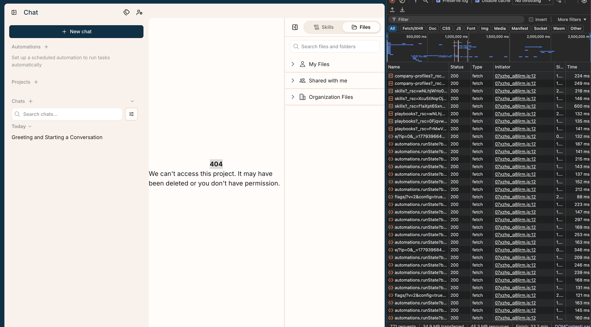

# Bug Report: Deleted project shows ambiguous 404 state without clear recovery path

## Summary
After deleting a project, directly opening the old project URL shows a 404 message saying the project may have been deleted or the user may not have permission. The message itself is helpful, but the surrounding UI is confusing because the user remains inside the Chat area, the sidebar says "No chats yet," and there is no clear next action such as returning to Projects or selecting a different project.

## Environment
- Browser: Chrome
- Account type: Free trial
- Area: Projects/Chat
- DevTools: network tab open with preserve log and disable cache enabled
- Date tested: May 21, 2026

## Steps to Reproduce
1. Create a project
2. Copy the project URL
3. Delete the project
4. Paste the copied project URL back into the browser
5. Observe the page state and DevTools Network tab

## Expected Behavior
After opening a deleted project URL, the app should show a clear deleted/unavailable project state with an obvious recovery action, such as:
- "This project was deleted."
- "Return to Projects."
- "Create a new project."
- "Open another project."

If the issue is permissions related the UI should distinguish that from deletion where possible.

## Actual Behavior
The page shows:

> 404 We can’t access this project. It may have been deleted or you don’t have permission.

However, the user remains in the Chat UI. This makes it unclear whether the user should start a chat, return to projects, refresh, or make an assumption that deletion failed/succeeded

## DevTools Observations
- The browser route still resolves to the deleted project URL.
- The main page renders a 404 unavailable project state.
- DevTools showed that the main web app loaded successfully, but once the app checked the project referenced by the URL, the UI displayed a 404 unavailable project state.
- A script request for `ionicons.js` returned 404, but this does not appear to be the cause of the project access message

## Hypothesis / Possible Root Cause
The frontend route is handling the deleted or inaccessible project state correctly at a basic level, but the error state is rendered inside the normal Chat layout rather than a dedicated project-not-found recovery view. App could also be using a shared message for both deleted projects and permission failures, which makes the state less actionable for users

## Severity
Low to Medium

This does not appear to cause data loss or block the entire app, but it creates confusion after a destructive action and could generate support questions and mainly an improvement for user experience

## Impact
Users working with legal projects may expect deletion to be final and clearly reflected in the UI. If an old project URL still opens into a partially normal Chat interface with a generic 404 users may wonder whether:
- the project was actually deleted,
- they lost permissions,
- the app is in a broken state,
- or they should start a new chat from the current screen.

## Suggested Customer Workaround
Advise the customer to return to the Projects list using the left navigation, refresh the page, and confirm the deleted project no longer appears there. If they reached the page from a bookmark or copied URL, they should discard that link and open active projects from the Projects page

## Suggested Engineering Follow-up
Create a dedicated deleted/inaccessible project state outside the normal Chat layout, or add a clear recovery CTA to the existing 404 state. Suggested buttons:
- "Back to Projects"
- "Create New Project"
- "Go to Home"
- "ET Phone Home"